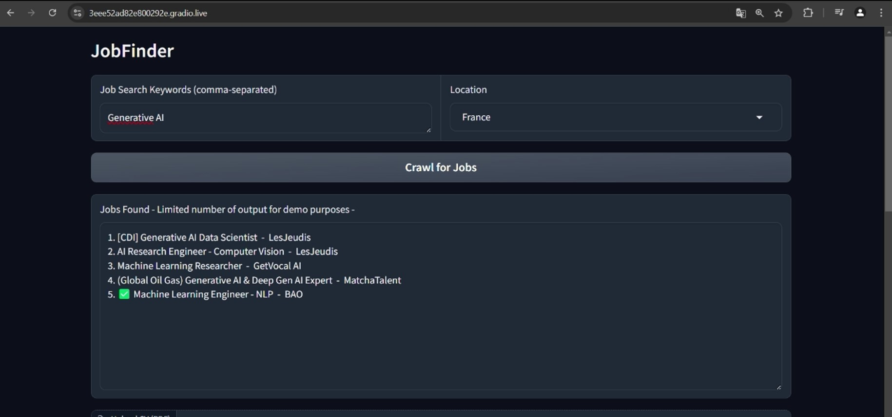
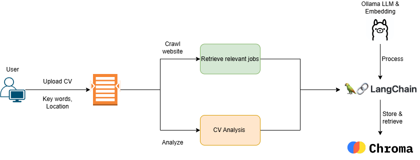

# JobFinder 
## Built using Ollama, LangChain, Chromadb, Gradio, BeautifulSoup

## Models used
` Ollama 3.1 8b
  Ollama Embeddings
`

## Introduction

This feels like the next logical step to [The Presentator](https://github.com/Salim-AA/Presentator), where I created an AI assistant that generates presentations for my Masters report. Once graduated, the next challenge is to find a job, hence the idea for this project. Unlike our previous fully cloud-based solution, this project processes data locally to maintain confidentiality. I'll use Ollama's local LLM & embedding models to ensure data privacy and security, particularly when handling all the PII within the CVs

## Goal 
Provide an efficient method for finding relevant job postings and evaluating how well a candidate's resume matches those job descriptions through web scraping Linkedin's publicly available job offers, text processing, and AI-based resume analysis.

## Objectives

1. Crawl and extract public job offers from LinkedIn based on user-provided keywords and locations
2. Return the found jobs along with the company name
3. Analyze resumes by comparing them against job descriptions to assess suitability
4. Ensure data privacy by processing all sensitive information locally using Ollama LLM


## Workflow
* Users input job search criteria and upload their resumes through the web interface
* The AI Agent coordinates the job crawling and resume analysis processes
* Job listings are crawled, processed, and stored in the Vector DB
* The Resume Analyzer processes user resumes, leveraging the RAG system and Private Ollama LLM
* Analysis results are returned to the user via the web interface

## Demo video

[]("Jobfinder_demo.mp4") 
## Architecture



## Moving forward
* Implement Maths agent for more accurate skill assessement
* Integrate additional job boards and career websites to broaden the job search
* Add advanced filtering options for more precise job search results
* Provide users with detailed analytics on their job search and resume performance


## Running on cloud-gpu

Since not everybody has a super pc at home, you can run Ollama on the Google colab gpus (AMAZING HOW EVERYTHING IS OPEN SOURCE AND FREE EVEN T4 RUNTIME !!!!!)

```python 
!sudo apt-get install -y pciutils
!curl -fsSL https://ollama.com/install.sh | sh # download ollama api
from IPython.display import clear_output
```
```python 
# Create a Python script to start the Ollama API server in a separate thread
import os
import threading
import subprocess
import requests
import json

def ollama():
    os.environ['OLLAMA_HOST'] = '0.0.0.0:11434'
    os.environ['OLLAMA_ORIGINS'] = '*'
    subprocess.Popen(["ollama", "serve"])

ollama_thread = threading.Thread(target=ollama)
ollama_thread.start()
clear_output()
```
```python
from IPython.display import clear_output
!ollama pull llama3.1:8b
clear_output()
```
```python
!pip install -U lightrag[ollama]

from lightrag.core.generator import Generator
from lightrag.core.component import Component
from lightrag.core.model_client import ModelClient
from lightrag.components.model_client import OllamaClient, GroqAPIClient

import time
clear_output()
```
